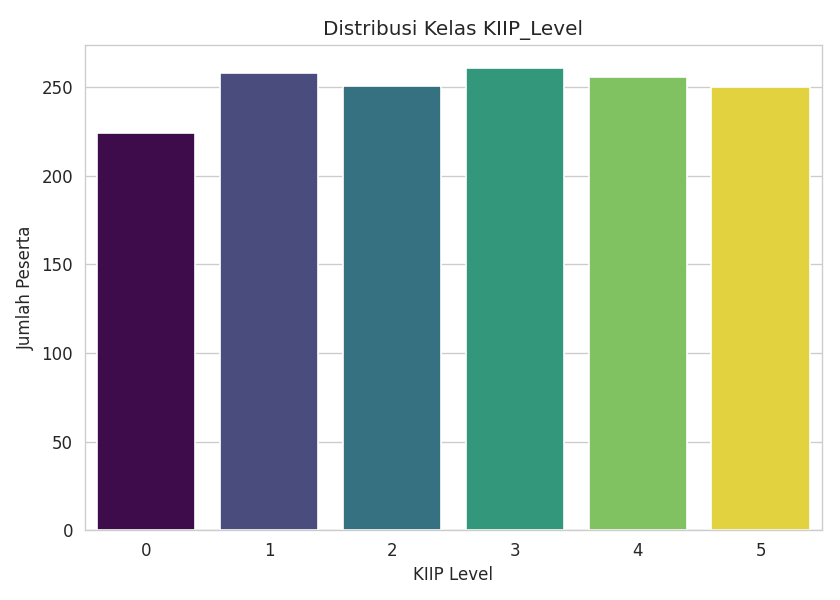
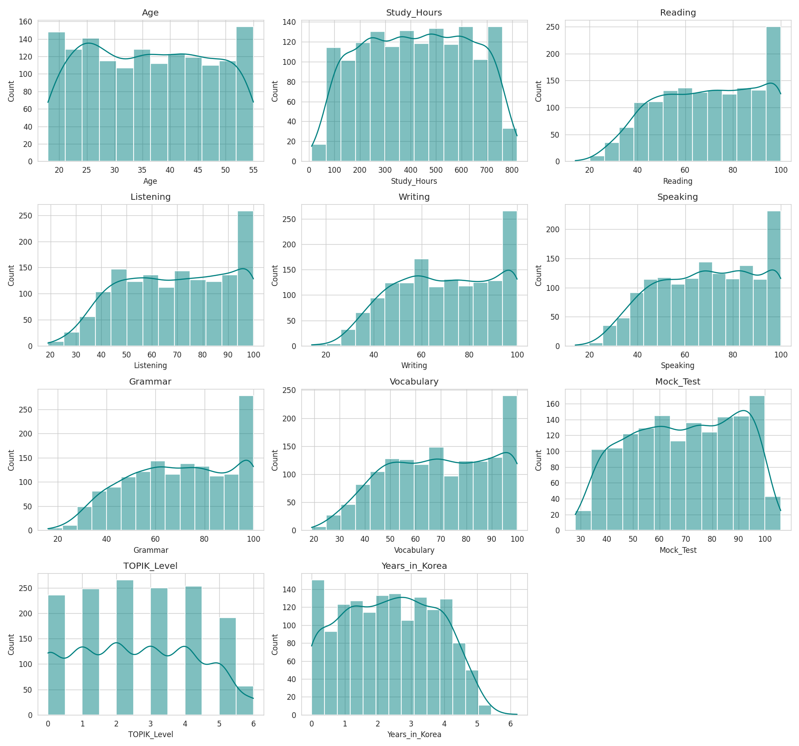
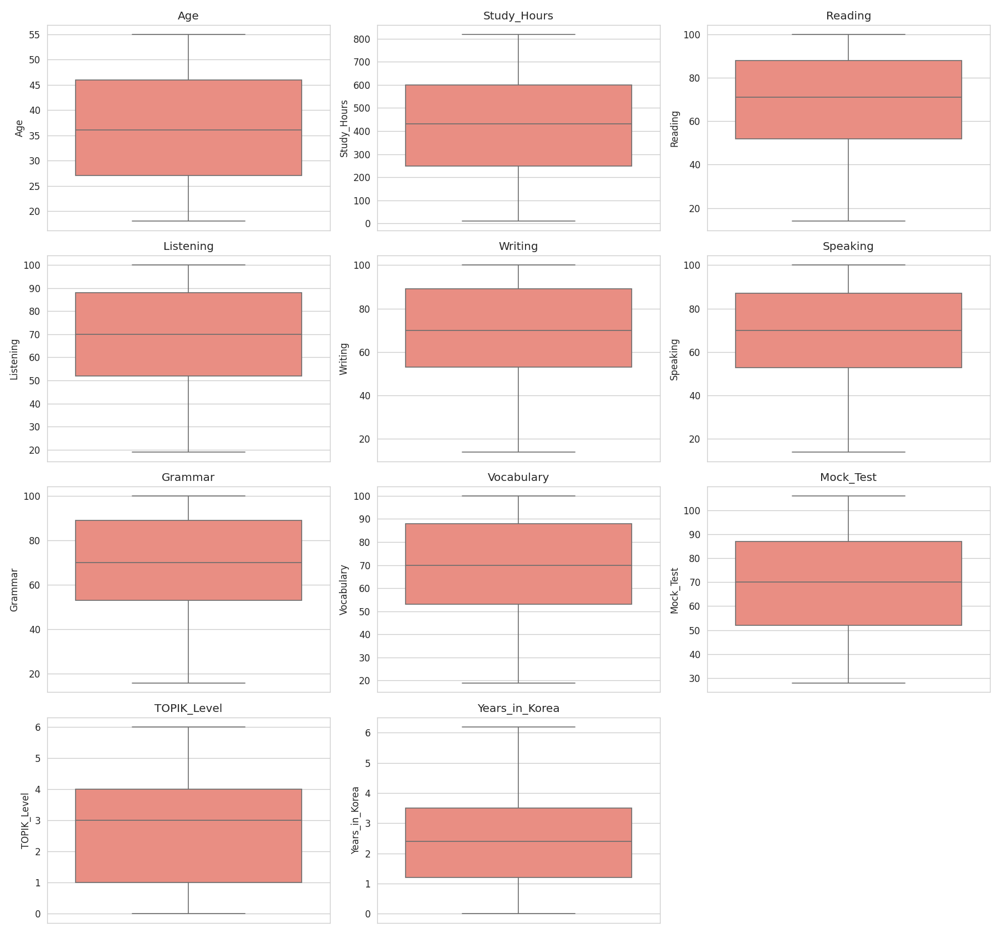
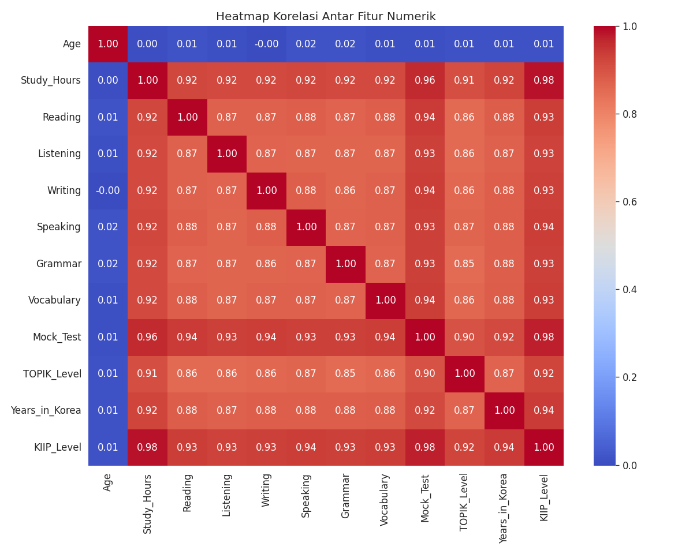
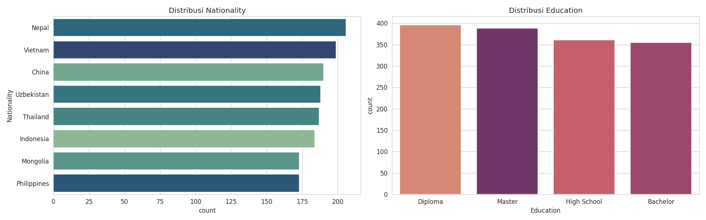
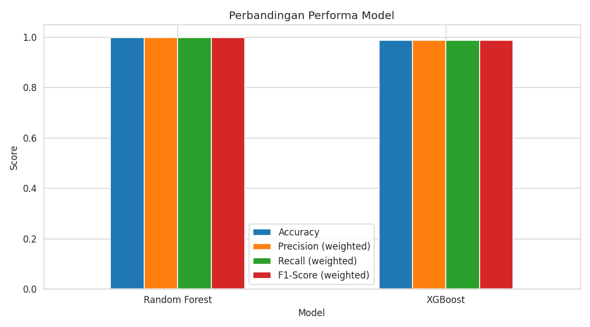
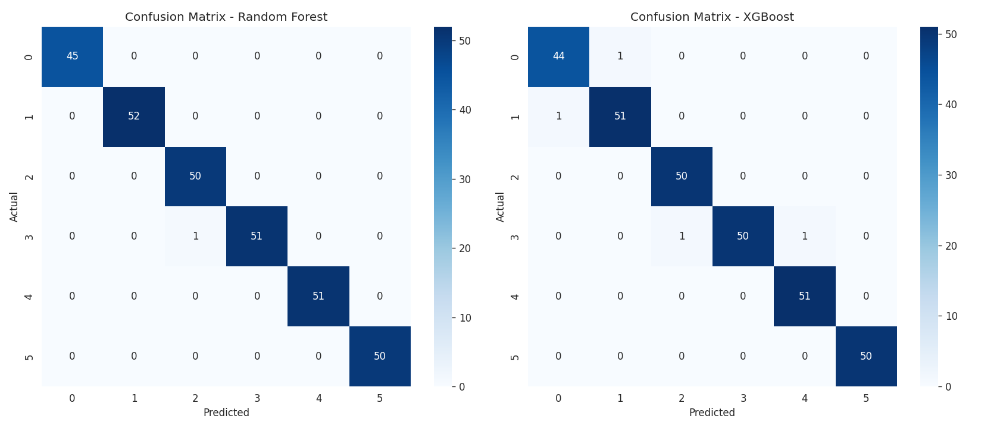
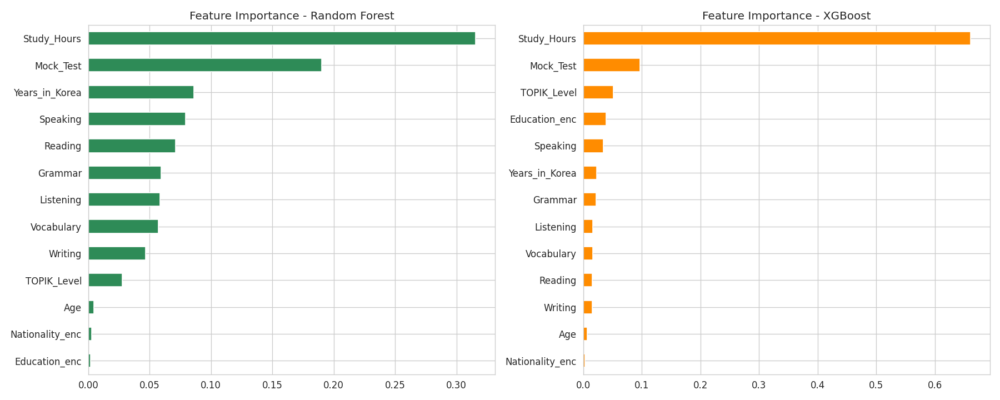

# Laporan Proyek Machine Learning - Sistem Prediksi Penempatan Level KIIP

## Domain Proyek

### Latar Belakang
Korean Immigration and Integration Program (KIIP) merupakan program resmi yang diselenggarakan oleh pemerintah Korea Selatan untuk membantu warga negara asing meningkatkan kemampuan bahasa Korea serta pemahaman terhadap budaya dan kehidupan di Korea. Salah satu tahapan penting dalam program ini adalah penentuan level awal peserta melalui tes penempatan (placement test) yang mengukur berbagai aspek kemampuan bahasa, seperti membaca (reading), mendengarkan (listening), berbicara (speaking), menulis (writing), tata bahasa (grammar), dan kosakata (vocabulary).

Proses penentuan level secara manual oleh penguji memerlukan evaluasi terhadap banyak aspek kemampuan peserta secara bersamaan, sehingga berpotensi memakan waktu lama dan rentan terhadap ketidakkonsistenan antar penguji maupun antar sesi tes. Oleh karena itu, diperlukan suatu sistem prediksi berbasis Machine Learning yang mampu membantu memperkirakan level KIIP peserta secara lebih cepat, objektif, dan konsisten berdasarkan data kemampuan bahasa yang dimiliki peserta.

### Masalah yang Harus Diselesaikan
Ketidakkonsistenan dan lamanya waktu proses penentuan level KIIP secara manual perlu diatasi dengan membangun sistem prediksi otomatis yang dapat mengestimasi level penempatan peserta berdasarkan skor kemampuan bahasa, hasil tes simulasi, latar belakang pendidikan, kewarganegaraan, dan lama tinggal di Korea, sehingga proses penempatan menjadi lebih efisien dan objektif.

Format Referensi: [KIIP - Korea Immigration & Integration Program (Ministry of Justice)](https://www.moj.go.kr)

## Business Understanding

### Problem Statements
Bagaimana cara membangun model Machine Learning yang mampu memprediksi level penempatan KIIP (`KIIP_Level`) seorang peserta secara akurat berdasarkan data kemampuan bahasa Korea, hasil tes simulasi, latar belakang pendidikan, kewarganegaraan, dan lama tinggal di Korea?

### Goals
- Membangun model klasifikasi yang dapat memprediksi level penempatan KIIP peserta (0-5) berdasarkan data kemampuan bahasa Korea yang dimiliki.
- Membandingkan performa dua algoritma Machine Learning, yaitu Random Forest dan XGBoost, dalam menyelesaikan permasalahan klasifikasi ini.
- Mengidentifikasi fitur-fitur yang paling berpengaruh terhadap penentuan level KIIP sebagai insight tambahan bagi penyelenggara program.

### Solution Statements
- **Pendekatan pertama**: Membangun model klasifikasi menggunakan algoritma **Random Forest**, yaitu algoritma ensemble berbasis *bagging* dari banyak decision tree, yang robust terhadap overfitting dan mudah diinterpretasi melalui feature importance.
- **Pendekatan kedua**: Membangun model klasifikasi menggunakan algoritma **XGBoost**, yaitu algoritma ensemble berbasis *gradient boosting* yang membangun pohon secara sekuensial untuk memperbaiki kesalahan model sebelumnya. Algoritma ini dipilih sebagai bentuk eksplorasi mandiri karena belum diajarkan di kelas.

Evaluasi dari kedua solusi ini menggunakan metrik **Accuracy, Precision, Recall, dan F1-Score (weighted average)**, karena permasalahan bersifat klasifikasi multi-kelas (6 kelas level KIIP: 0-5).

## Data Understanding
Dataset yang digunakan adalah **KIIP Dataset**, yang terdiri dari data kemampuan bahasa Korea dan hasil tes peserta program KIIP.

**Informasi Dataset:**
- Jumlah data: 1.500 baris dan 14 kolom.
- Kondisi data:
    - Missing values: Tidak ditemukan missing values pada seluruh kolom, berdasarkan hasil pengecekan `isnull().sum()`.
    - Duplikat: Tidak ditemukan data duplikat, berdasarkan hasil pengecekan `duplicated().sum()`.
    - Format data: Kolom `Years_in_Korea` awalnya tersimpan dalam format string dengan pemisah desimal koma (misal `"4,1"`), sehingga perlu dikonversi ke tipe numerik (float) pada tahap Data Preparation.
    - Distribusi kelas target `KIIP_Level` relatif seimbang, dengan jumlah data per kelas berkisar antara 224 hingga 261 sampel dari total 1.500 data, sehingga tidak diperlukan teknik penyeimbangan kelas khusus.

**Fitur pada KIIP Dataset:**
- `Age`: Usia peserta.
- `Nationality`: Kewarganegaraan peserta (8 kategori: Indonesia, China, Mongolia, Thailand, Uzbekistan, Nepal, Philippines, Vietnam).
- `Study_Hours`: Total jam belajar bahasa Korea.
- `Reading`: Skor kemampuan membaca (0-100).
- `Listening`: Skor kemampuan mendengar (0-100).
- `Writing`: Skor kemampuan menulis (0-100).
- `Speaking`: Skor kemampuan berbicara (0-100).
- `Grammar`: Skor tata bahasa (0-100).
- `Vocabulary`: Skor kosakata (0-100).
- `Mock_Test`: Skor hasil tes simulasi/uji coba.
- `Education`: Latar belakang pendidikan (High School, Diploma, Bachelor, Master).
- `TOPIK_Level`: Level sertifikasi TOPIK yang dimiliki peserta (0-6).
- `Years_in_Korea`: Lama tinggal di Korea (dalam tahun).
- `KIIP_Level`: **(target)** Level penempatan KIIP (0-5).

### Exploratory Data Analysis (EDA)
Eksplorasi data dilakukan untuk memahami distribusi tiap fitur, mendeteksi potensi outlier, serta melihat hubungan antar fitur dan target.

**Visualisasi:**

- **Distribusi Target (`KIIP_Level`)**: Distribusi kelas target relatif seimbang di seluruh 6 kelas.

- **Distribusi Fitur Numerik**: Sebagian besar fitur skor kemampuan bahasa dan `Study_Hours` menunjukkan distribusi yang cukup merata, sementara `Age` cenderung terdistribusi normal di kisaran usia 20-55 tahun.

- **Boxplot Fitur Numerik**: Digunakan untuk mendeteksi potensi outlier pada tiap fitur numerik.

- **Heatmap Korelasi**: Fitur `Study_Hours`, `Mock_Test`, `Years_in_Korea`, serta seluruh skor kemampuan bahasa menunjukkan korelasi yang sangat tinggi (>0.9) terhadap `KIIP_Level`, sementara `Age` hampir tidak berkorelasi dengan target.

- **Distribusi Fitur Kategorikal**: Menunjukkan sebaran jumlah peserta berdasarkan kewarganegaraan dan latar belakang pendidikan.

**Insight:** Korelasi yang sangat tinggi antara fitur skor kemampuan bahasa dengan `KIIP_Level` mengindikasikan bahwa penentuan level pada dataset ini kemungkinan mengikuti pola/aturan yang cukup konsisten, sehingga model berbasis pohon keputusan berpotensi mencapai performa yang sangat tinggi.

## Data Preparation
Tahapan data preparation yang dilakukan pada dataset ini:

1. **Konversi format data**: Kolom `Years_in_Korea` yang awalnya berformat string dengan koma desimal (misal `"4,1"`) dikonversi menjadi tipe data float (misal `4.1`) agar dapat diproses oleh model Machine Learning.
2. **Encoding fitur kategorikal**: Fitur `Nationality` dan `Education` yang bertipe kategorikal diubah menjadi representasi numerik menggunakan `LabelEncoder` dari `sklearn.preprocessing`, karena kedua algoritma yang digunakan (Random Forest dan XGBoost) memerlukan input numerik.
3. **Pemisahan fitur dan target**: Seluruh kolom kecuali `KIIP_Level` digunakan sebagai fitur prediktor (X), sementara `KIIP_Level` digunakan sebagai target (y).
4. **Train-test split**: Dataset dibagi menjadi data latih (80%) dan data uji (20%) menggunakan `train_test_split`, dengan parameter `stratify=y` untuk menjaga proporsi tiap kelas tetap seimbang di kedua subset, dan `random_state=42` agar hasil pembagian data dapat direproduksi.
5. **Standardisasi**: Fitur numerik distandarisasi menggunakan `StandardScaler` agar seluruh fitur berada dalam skala yang seragam (rata-rata 0, standar deviasi 1). Scaler ini disimpan sebagai bagian dari pipeline deployment.

**Alasan Data Preparation:**
Langkah-langkah di atas diperlukan untuk memastikan seluruh fitur berada dalam format dan skala yang sesuai untuk diproses oleh algoritma Machine Learning, menjaga proporsi kelas pada saat evaluasi model (melalui stratified split), serta memastikan hasil eksperimen dapat direproduksi.

## Modeling
Pada proyek ini, digunakan dua algoritma klasifikasi untuk memprediksi `KIIP_Level`, yaitu **Random Forest** dan **XGBoost**. Kedua model dilatih pada data yang sama agar performanya dapat dibandingkan secara adil.

### Random Forest Classifier
Random Forest bekerja dengan cara membangun banyak decision tree secara independen pada subset data dan fitur yang diambil secara acak (*bagging*), kemudian menggabungkan hasil prediksi tiap pohon melalui voting mayoritas (untuk klasifikasi).

**Parameter yang digunakan:**
- `n_estimators=200`: jumlah pohon yang dibangun dalam forest.
- `max_depth=None`: pohon dibiarkan tumbuh hingga daun murni (default).
- `random_state=42`: memastikan hasil dapat direproduksi.
- `n_jobs=-1`: menggunakan seluruh core CPU untuk mempercepat proses training.

### XGBoost Classifier
XGBoost (Extreme Gradient Boosting) bekerja dengan cara membangun pohon keputusan secara sekuensial (*boosting*), di mana setiap pohon baru berusaha memperbaiki kesalahan (residual error) dari pohon-pohon sebelumnya. Algoritma ini dipilih sebagai eksplorasi mandiri karena belum diajarkan di kelas.

**Parameter yang digunakan:**
- `n_estimators=200`: jumlah boosting round/pohon.
- `max_depth=6`: kedalaman maksimum tiap pohon.
- `learning_rate=0.1`: laju kontribusi tiap pohon terhadap prediksi akhir.
- `eval_metric='mlogloss'`: metrik loss yang digunakan untuk klasifikasi multi-kelas.
- `random_state=42`: memastikan hasil dapat direproduksi.

**Kelebihan dan Kekurangan:**
| Aspek | Random Forest | XGBoost |
|---|---|---|
| Kelebihan | Robust terhadap overfitting, mudah diinterpretasi, cepat dilatih | Umumnya performa lebih tinggi pada data tabular, dapat menangani pola kompleks |
| Kekurangan | Bisa kurang optimal pada pola yang sangat kompleks | Lebih rentan overfitting jika parameter tidak di-tuning, waktu training relatif lebih lama |

Berdasarkan hasil evaluasi pada bagian selanjutnya, **Random Forest** dipilih sebagai model terbaik karena memberikan performa sedikit lebih tinggi dan lebih stabil dibanding XGBoost pada dataset ini.

## Evaluation
Metrik evaluasi yang digunakan untuk mengukur performa model klasifikasi multi-kelas ini adalah:
- **Accuracy**: proporsi prediksi yang benar terhadap keseluruhan data. Formula: `(TP + TN) / (TP + TN + FP + FN)`.
- **Precision (weighted)**: rata-rata precision tiap kelas, dibobot berdasarkan jumlah sampel tiap kelas. Formula tiap kelas: `TP / (TP + FP)`.
- **Recall (weighted)**: rata-rata recall tiap kelas, dibobot berdasarkan jumlah sampel tiap kelas. Formula tiap kelas: `TP / (TP + FN)`.
- **F1-Score (weighted)**: harmonic mean dari precision dan recall, dibobot berdasarkan jumlah sampel tiap kelas. Formula: `2 * (Precision * Recall) / (Precision + Recall)`.

### Hasil Evaluasi

| Model | Accuracy | Precision (weighted) | Recall (weighted) | F1-Score (weighted) |
|---|---|---|---|---|
| Random Forest | 0.9967 | 0.9967 | 0.9967 | 0.9967 |
| XGBoost | 0.9867 | 0.9868 | 0.9867 | 0.9866 |

**Confusion Matrix:**

Confusion matrix menunjukkan bahwa kesalahan prediksi pada kedua model sangat sedikit dan umumnya hanya terjadi antar kelas yang bertetangga (misalnya level 3 diprediksi sebagai level 4), yang menunjukkan model memahami urutan level dengan baik.

**Feature Importance:**

Kedua model secara konsisten menunjukkan bahwa `Study_Hours` dan `Mock_Test` merupakan fitur yang paling berpengaruh terhadap prediksi `KIIP_Level`, diikuti oleh skor-skor kemampuan bahasa lainnya. Fitur `Age` memiliki kontribusi yang sangat kecil terhadap prediksi.

**Catatan Evaluasi:**
Kedua model mencapai performa yang sangat tinggi (>98% pada seluruh metrik). Hal ini konsisten dengan temuan pada tahap EDA, di mana fitur `Study_Hours`, `Mock_Test`, dan skor-skor kemampuan bahasa memiliki korelasi yang sangat tinggi (>0.9) terhadap `KIIP_Level`, sehingga pola hubungan antara fitur dan target relatif mudah dipelajari oleh model berbasis pohon keputusan. Perlu dicatat bahwa pada penerapan di dunia nyata dengan data yang lebih bervariasi dan mengandung noise, performa model kemungkinan akan sedikit lebih rendah dibanding hasil pada dataset ini.

**Dampak terhadap Business Understanding:**
- **Problem Statement**: Kedua model berhasil menjawab problem statement mengenai prediksi level penempatan KIIP peserta berdasarkan data kemampuan bahasa yang dimiliki.
- **Goals**: Model Random Forest dan XGBoost berhasil mencapai tujuan proyek, yaitu membangun sistem prediksi level KIIP yang akurat, membandingkan performa kedua algoritma, serta mengidentifikasi fitur-fitur yang paling berpengaruh (`Study_Hours` dan `Mock_Test`) terhadap penentuan level.
- **Solution Statement**: Kedua algoritma yang diusulkan (Random Forest dan XGBoost) terbukti mampu menyelesaikan permasalahan klasifikasi ini dengan baik, dengan Random Forest memberikan performa sedikit lebih unggul pada dataset ini.

## Deployment
Model terbaik (**Random Forest**) di-deploy sebagai aplikasi interaktif menggunakan **Gradio** dan di-hosting pada **Hugging Face Spaces**, sehingga pengguna dapat memasukkan data kemampuan bahasa dan memperoleh prediksi level KIIP secara langsung melalui antarmuka web.

- Source code deployment tersedia pada folder `deployment/` (`app.py`, `requirements.txt`, serta artefak model `.pkl`).
- Link Hugging Face Space: `[isi dengan link Space kamu setelah proses deploy]`

## Kesimpulan
Proyek ini berhasil membangun sistem prediksi level penempatan KIIP menggunakan algoritma Random Forest dan XGBoost, dengan performa yang sangat baik pada kedua model (akurasi >98%). Model Random Forest dipilih sebagai model final karena menunjukkan performa sedikit lebih tinggi dan stabil. Sistem ini diharapkan dapat membantu penyelenggara program KIIP dalam melakukan penempatan level peserta secara lebih cepat, konsisten, dan objektif, sekaligus memberikan insight mengenai fitur-fitur yang paling menentukan level kemampuan bahasa peserta.
